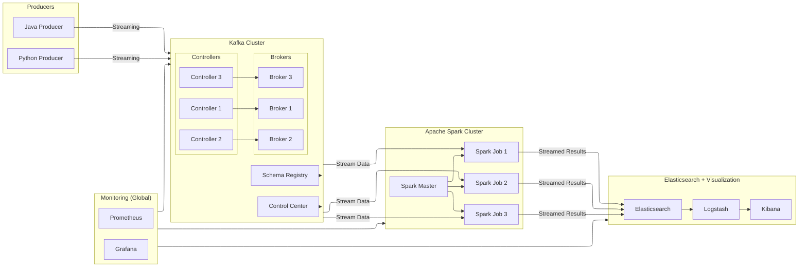
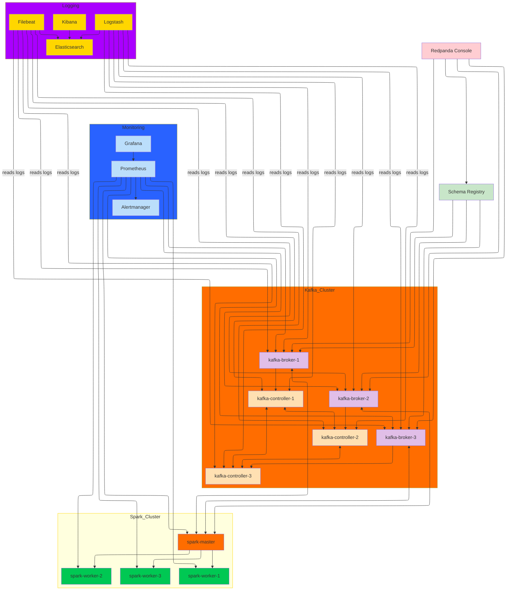

# System Architecture

# Real-Time Data Streaming Architecture (Kafka + Spark + Elasticsearch + Kibana)

This architecture demonstrates a **real-time streaming pipeline** using the following components:

---

## 🔄 Data Producers

- **Java** and **Python** applications act as producers that publish streaming data into Kafka topics.
- Each producer can send JSON or Avro messages to Kafka based on a defined schema.

---

## 🧠 Kafka Cluster

- Consists of:
  - **Kafka Controllers** (leader election, metadata management)
  - **Kafka Brokers** (actual message storage and retrieval)
  - **Schema Registry** to manage data schemas (e.g., Avro)
  - **Control Center** for visual monitoring of topics, consumers, lag, etc.

---

## ⚡ Stream Processing with Apache Spark

- Spark jobs continuously consume messages from Kafka.
- Transformations include:
  - Parsing & cleansing
  - Aggregations or joins
  - Enriching with metadata
- Output is streamed directly to **Elasticsearch** for indexing.

---

## 🔍 Elasticsearch Stack (ELK)

- **Elasticsearch** stores structured streaming data for fast querying.
- **Logstash** (optional) can further enrich, transform, or route data.
- **Kibana** provides visualization dashboards for real-time insights.

---

## 📈 Monitoring

- **Prometheus** collects system and application metrics.
- **Grafana** visualizes Spark/Kafka health and performance metrics.

---

## 🐳 Containerized Deployment

- All components are designed to run within Docker containers using Docker Compose or Kubernetes.
- Ensures reproducible, scalable, and isolated environments for testing and production.

---

## ✅ Use Cases

- Real-time financial fraud detection
- IoT device analytics
- Clickstream analysis
- Log ingestion & alerting

